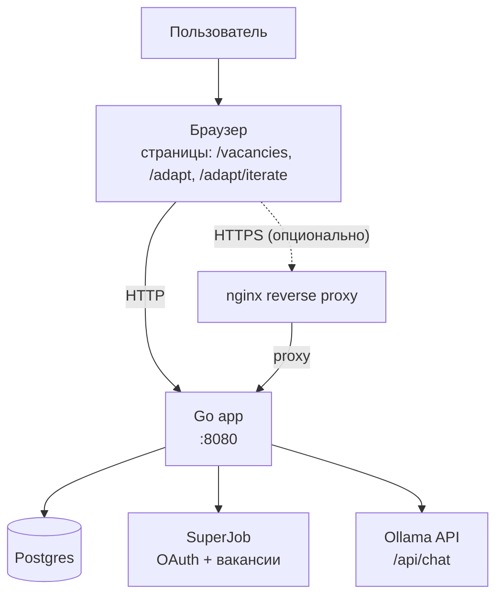
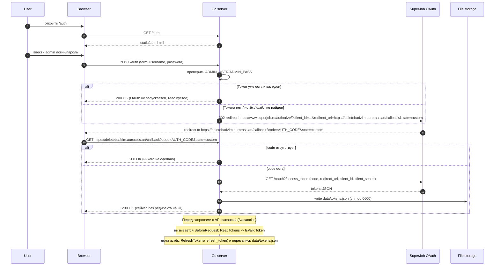
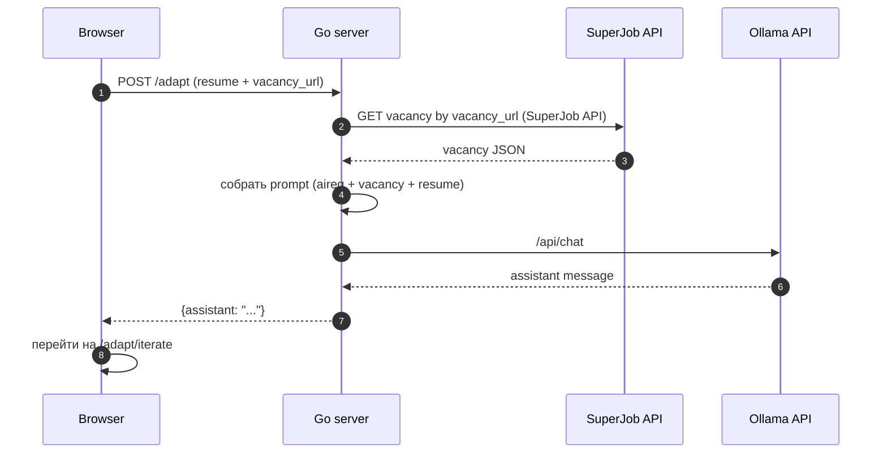
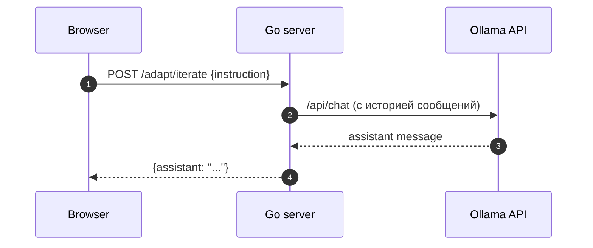

# Архитектура 

## Проект на текущий момент

Что есть:
- поиск вакансий через SuperJob (OAuth) и UI `/vacancies`;
- UI для адаптации резюме + чат с ИИ: `/adapt` и `/adapt/iterate`.

TODO (чтобы не забыть):
- конвертация в PDF: в UI есть кнопка `POST /adapt/finalize`, но в Go это пока не реализовано.

Термины:
- **UI (интерфейс пользователя)** — страница в браузере.
- **OAuth** — способ входа в API по токену (без пароля).

## Как выглядит по-крупному (схема)

Это “одна картинка”, чтобы понять систему целиком.

Термины:
- **reverse-proxy (обратный прокси)** — nginx принимает запросы снаружи и пересылает их в app.
- **volume (том)** — место в Docker, где хранятся данные Postgres, чтобы они не пропадали при перезапуске контейнера.

## Контейнеры (Docker Compose)

По README у нас запускаются контейнеры:
- `app` — Go сервис на `:8080`.
- `postgres` — база данных.
- `nginx` — обратный прокси на `80/443` (нужны свободные порты).
- `certbot` — утилита для сертификатов Let's Encrypt (запускается командой `docker compose run ...`).

Термины:
- **контейнер** — “упакованный процесс” с зависимостями.
- **Docker Compose** — запускает несколько контейнеров одной командой.

## Что где лежит в репозитории

- UI адаптации и чата: [static/adapt.html](static/adapt.html)
- Инструкция ИИ (system prompt): [static/aireq.txt](static/aireq.txt)
- Роуты сервера: [pkg/server/server.go](pkg/server/server.go)
- Хендлеры (логика запросов): [pkg/handlers/handler.go](pkg/handlers/handler.go)
- Сборка текста резюме в промпт: [pkg/helpers/resume.go](pkg/helpers/resume.go)
- Шаблон для печати: [static/resume_preview.html](static/resume_preview.html)

## Роуты (как сейчас в коде)

Смотри регистрацию роутов в [pkg/server/server.go](pkg/server/server.go).

### OAuth / SuperJob
- `GET /auth` — HTML-форма логина (локальная проверка admin).
- `POST /auth` — проверка `ADMIN_USER/ADMIN_PASS` и редирект на SuperJob OAuth.
- `GET /callback` — обмен `code` на токены, сохранение в файл.

### Вакансии
- `GET /vacancies` без query-параметров — отдаёт форму.
- `POST /vacancies` запрос на поиск вакансий с заполненными фильтрами - отправка на сервер, он редиректит запрос с фильтрами в API Superjob

### ИИ (адаптация резюме)

Страницы:
- `GET /adapt` — стартовая страница (форма пустая).
- `GET /adapt/iterate` — страница “форма + чат” (там можно править резюме и писать инструкции (todo: доделать реализацию кнопки "преобразовать в pdf)).

API:
- `POST /adapt` — “Старт”: отправляем резюме + ссылку на вакансию и получаем первый ответ ИИ.
- `POST /adapt/iterate` — “Отправить правку”: отправляем `{instruction}` и получаем следующий ответ ИИ.

TODO:
- `POST /adapt/finalize` — кнопка есть во фронте, но роут сейчас не зарегистрирован в сервере.

## Как работает адаптация (2 сценария)

Важно про текущий статус:
- фронт в [static/adapt.html](static/adapt.html) отправляет на `POST /adapt` JSON (Content-Type: `application/json`) со структурой `types.Resume`.

Ниже диаграммы показывают целевую идею потока (UI → сервер → Ollama), плюс отдельно — как устроен OAuth.

## OAuth: как появляются токены SuperJob

Точка хранения токенов — файл `data/tokens.json` (см. константу в [pkg/consts/const.go](pkg/consts/const.go)).

Связанные места в проекте:
- генерация URL авторизации: [pkg/helpers/auth.go](pkg/helpers/auth.go) (использует `CLIENT_ID`, `BASE_URL`)
- токены и refresh: [pkg/middleware/tokensfunc.go](pkg/middleware/tokensfunc.go) (использует `CLIENT_ID`, `CLIENT_SECRET`, `BASE_URL`)
- чтение/валидация токенов: [pkg/helpers/tokens.go](pkg/helpers/tokens.go)
- точка входа: `GET/POST /auth` в [pkg/handlers/handler.go](pkg/handlers/handler.go)

### 1) Старт: резюме + вакансия → первый ответ

### 2) Итерация: короткая инструкция → уточнённый ответ

## Про состояние (важный момент)

Тут две “памяти”:
- в браузере: `localStorage` (резюме и чат сохраняются для `/adapt/iterate`)(на фронте);
- на сервере: `ollamaSession.Messages` (история сообщений для модели).

Термин:
- **localStorage** — хранение данных в браузере (переживает F5).

Честно: с серверной сессией ещё не идеально.
Сейчас при новом “Старт” сервер может продолжить старую историю сообщений (это стоит проверить/поправить).

## Взаимодействие пользователя и что он получает

- Пользователь открывает `/adapt` в браузере и заполняет форму резюме 
- При нажатии "Отправить резюме" фронтенд отправляет POST `/adapt` (JSON с полями `types.Resume`).
- Сервер собирает данные вакансии и резюме в единый промпт вместе с шаблоном инструкций [static/aireq.txt](static/aireq.txt) и вызывает модель; ответ приходит в виде строки (`assistant`), которая отображается в чате.

## Как формируется промпт и в каком виде он уходит к модели

- Состав промпта:
  - системная инструкция (system prompt) — файл [static/aireq.txt](static/aireq.txt). Там описаны правила, порядок разделов резюме и ограничения.
  - текст вакансии — получается вызовом SuperJob API по `vacancy_url` (см. `pkg/superjob/*`). Вакансии приводятся в текстовом виде (`vacancyToText` / `VacancyToText`).
  - текст резюме — фронтенд отправляет JSON, используется `pkg/helpers/resume.go: func BuildResumeText` для формирования плоского текста.
  - при итерациях: история сообщений (в памяти `ollamaSession.Messages`) добавляется как предыдущие user/assistant turns.

- Технически: в `pkg/handlers/handler.go` собирается один большой пользовательский контент (`userContent`) — объединение системной инструкции, вакансии и резюме через разделители (в коде используются `"\n\n"`), затем этот `userContent` добавляется в `ollamaSession.Messages` как сообщение с ролью `user`.

- Модель вызывается через `pkg/ollama.OllamaRequest` — код преобразовывает `ollama.ChatSession` (поле `Messages`) в JSON и POST-ит на `https://ollama.com/api/chat` (см. `pkg/ollama/ollama.go`). Сервер получает ответ в формате JSON `{ message: { role, content } }` и берёт `message.content` как текст ответа.

## Что в итоге — PDF и формат итогового документа

- Цель: получить аккуратно отформатированное адаптированное резюме в PDF, с разделами в порядке, описанном в `static/aireq.txt` (личные данные, желаемая должность, опыт, образование, навыки, дополнительная информация).
Вариант реализации: к ИИ-модели в чате с готовым шаблоном промпта писать запрос на конвертацию последнего ответа ИИ в JSON-структуру, итеративно отредактировать с этой же моделью структуру, после чего перевести JSON-структуру в html-шаблон для дальнейшей конвертации его в pdf 

## Mermaid: как корректно смотреть диаграммы

- Для корректного рендера диаграмм в VS Code нужно либо включить встроенную поддержку Mermaid в превью Markdown (`.vscode/settings.json`: `"markdown.preview.mermaid": true`), либо установить официальное расширение Mermaid Preview (или аналог от mermaid.live). В этом репозитории я использовал флаг в `.vscode/settings.json`.
- Без включённого рендера VS Code покажет содержимое блоков Mermaid как текст — это та проблема, с которой столкнулась твоя ментор.

