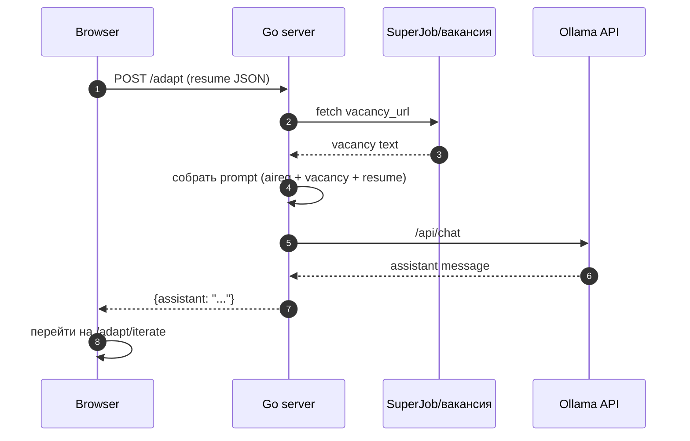
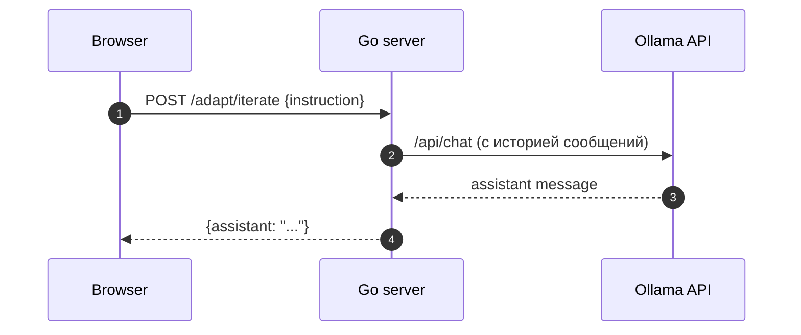
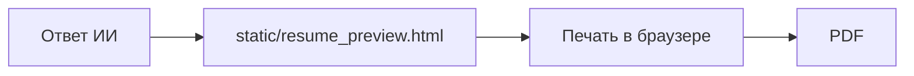

# Архитектура (черновик как у новичка)

Я впервые описываю архитектуру, поэтому пишу максимально просто.
Если что-то звучит странно — значит это место надо допилить.

## Проект на текущий момент

Что есть:
- поиск вакансий через SuperJob (OAuth) и UI `/vacancies`;
- UI для адаптации резюме + чат с ИИ: `/adapt` и `/adapt/iterate`.

TODO (чтобы не забыть):
- конвертация в PDF: в UI есть кнопка `POST /adapt/finalize`, но в Go это пока не реализовано.

Термины:
- **UI (интерфейс пользователя)** — страница в браузере.
- **OAuth** — способ входа в API по токену (без пароля).

## Как выглядит по-крупному (схема)

Это “одна картинка”, чтобы понять систему целиком.

```mermaid
graph TD
  U[Пользователь] --> B[Браузер\nстраницы: /vacancies, /adapt, /adapt/iterate]

  B -->|HTTP| GO[Go app :8080]
  B -.->|HTTPS (опционально)| NX[nginx reverse proxy]
  NX -->|proxy| GO

  GO --> DB[(Postgres)]
  GO --> SJ[SuperJob\nOAuth + вакансии]
  GO --> OL[Ollama API\n/api/chat]

  B --> PREV[static/resume_preview.html\nпечать]
  PREV -->|Ctrl+P| PDF[PDF]
```

Термины:
- **reverse-proxy (обратный прокси)** — nginx принимает запросы снаружи и пересылает их в app.
- **volume (том)** — место в Docker, где хранятся данные Postgres, чтобы они не пропадали при перезапуске контейнера.

## Контейнеры (Docker Compose)

По README у нас запускаются контейнеры:
- `app` — Go сервис на `:8080`.
- `postgres` — база данных.
- `nginx` — обратный прокси на `80/443` (нужны свободные порты).
- `certbot` — утилита для сертификатов Let's Encrypt (запускается командой `docker compose run ...`).

Термины:
- **контейнер** — “упакованный процесс” с зависимостями.
- **Docker Compose** — запускает несколько контейнеров одной командой.

## Что где лежит в репозитории

- UI адаптации и чата: [static/adapt.html](static/adapt.html)
- Инструкция ИИ (system prompt): [static/aireq.txt](static/aireq.txt)
- Роуты сервера: [pkg/server/server.go](pkg/server/server.go)
- Хендлеры (логика запросов): [pkg/handlers/handler.go](pkg/handlers/handler.go)
- Сборка текста резюме в промпт: [pkg/helpers/resume.go](pkg/helpers/resume.go)
- Шаблон для печати: [static/resume_preview.html](static/resume_preview.html)

## Роуты (как я их понял)

### Вакансии
- `GET /vacancies` — форма фильтров.
- `GET/POST /vacancies` — поиск вакансий (зависит от параметров/запроса).

### ИИ (адаптация резюме)

Страницы:
- `GET /adapt` — стартовая страница (форма пустая).
- `GET /adapt/iterate` — страница “форма + чат” (там можно править резюме и общаться).

API:
- `POST /adapt` — “Старт”: отправляем резюме + ссылку на вакансию и получаем первый ответ ИИ.
- `POST /adapt/iterate` — “Отправить правку”: отправляем `{instruction}` и получаем следующий ответ ИИ.

TODO:
- `POST /adapt/finalize` — кнопка есть, но сервера пока нет.

Термины:
- **GET/POST** — методы HTTP: GET “получить страницу/данные”, POST “отправить данные/сделать действие”.

## Как работает адаптация (2 сценария)

### 1) Старт: резюме + вакансия → первый ответ



### 2) Итерация: короткая инструкция → уточнённый ответ



## Про состояние (важный момент)

Тут две “памяти”:
- в браузере: `localStorage` (резюме и чат сохраняются для `/adapt/iterate`);
- на сервере: `ollamaSession.Messages` (история сообщений для модели).

Термин:
- **localStorage** — хранение данных в браузере (переживает F5).

Честно: с серверной сессией ещё не идеально.
Сейчас при новом “Старт” сервер может продолжить старую историю сообщений (это стоит проверить/поправить).

## PDF (как сейчас планируется)

Пока самый простой путь — печать HTML в PDF.


